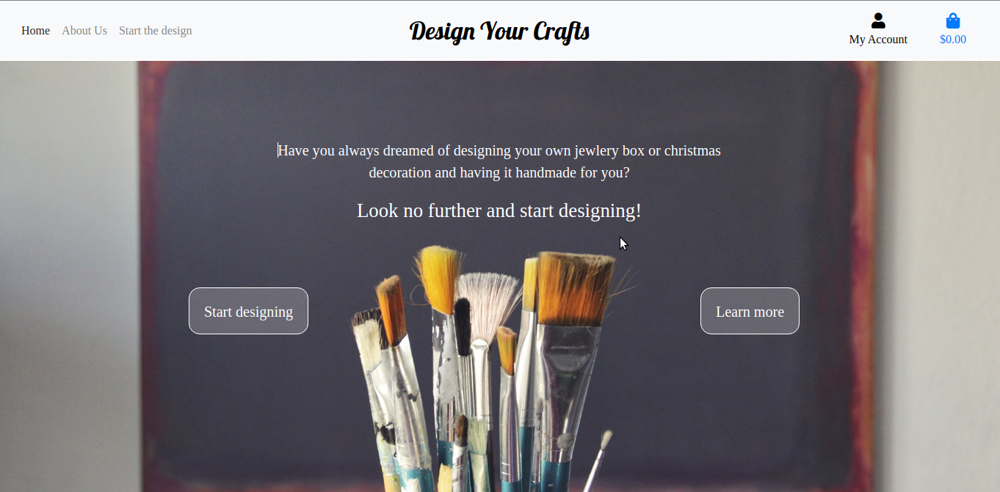
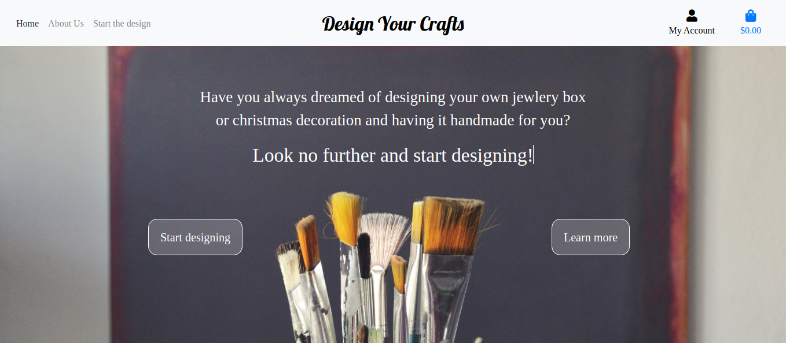
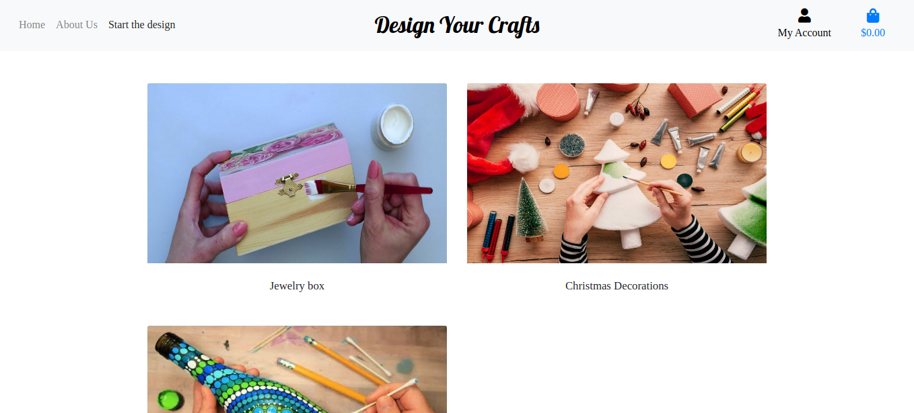
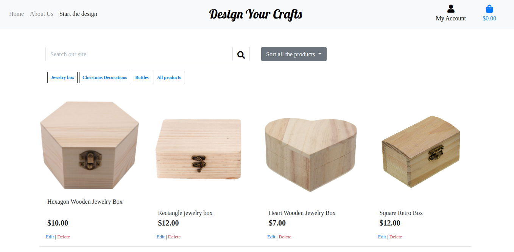
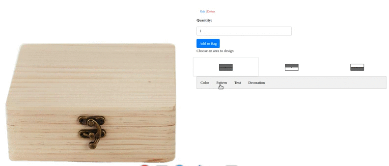
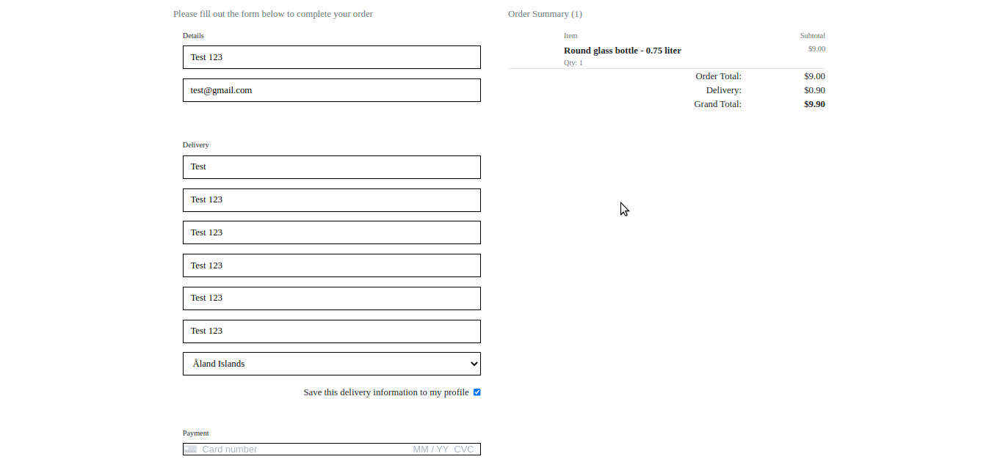
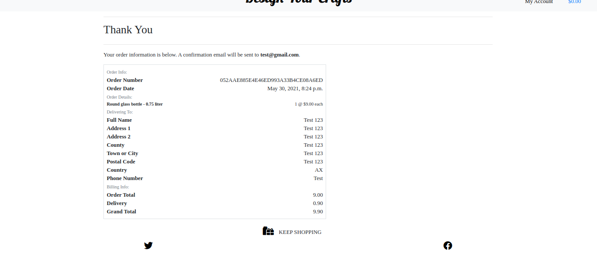
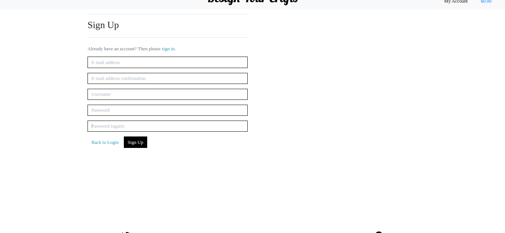
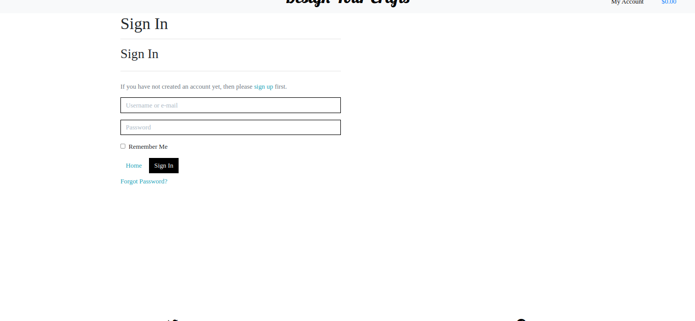
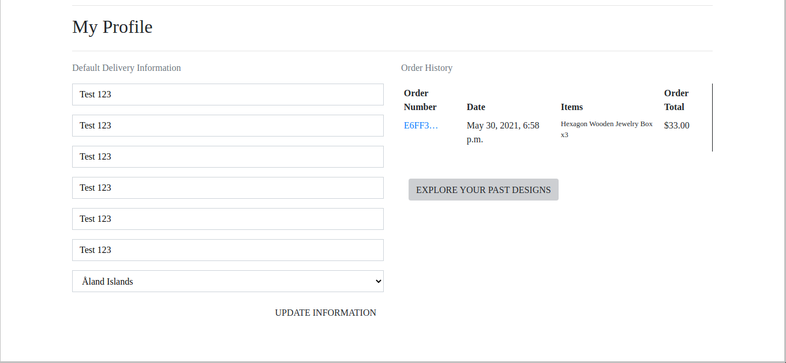

View the project on Heroku [here](https://design-your-crafts.herokuapp.com/)

# Overview

## Purpose of the application
Have you ever wanted to make your own craft but didn't have the time or the materials?
**Design Your Craft** is a page where you can design an item and have it handcrafted for you. 


## How does it work?

### First step: Choose an item you want to design  
Choose between jewelry boxes, christmas decoration or bottles.

### Second step: Design your product 
Choose between different patterns, decorations or customised messages

### Third step: Order a handcrafted item 
After you designed an item, it will be handcrafted by one of our team members and send out to you!

Users can create a handcrafted item with the **Design Your Craft** application upon their first use of the application. No registration is necessary to design and order an item.


Users who are interested can sign up and have their past designs and orders saved on the profile page. Users details can be saved on their profile to make an order quickly and the information can be edited or deleted easily.

# Features
The following are the features provided in the **Design Your Craft** application. 

## Navigation bar and Footer
* Each page features a **navigation bar** that has 3 navigation links - Home, About Us and Start the design. On a screen size smaller than a tablet the navbar becomes a collapsible element. In the right corner there are Profile and Shopping list icons.


* Each page features **social media links**  at the bottom. They redirect a user to the social media platform opening it in a new window. 

## Home & About page
* Users can learn about the purpose of the site on the Home and About page.

<p>&nbsp;</p>

<p>&nbsp;</p>

## Start the design
* The user is presented with 3 categories of the products - Jewellery boxes, Christmas decorations and Bottles.

    
    <p>&nbsp;</p>

* After deciding about a category, the user can choose a specific product to design.

    
    <p>&nbsp;</p>


### Search Functionality
It is possible to search for a specific word in the database.
 
### Sort Functionality
The sort functionality is available on all the products pages.


### Products by Category
You can navigate through different categories from the products page.


### Design options:
 - colors
 - patterns
 - text
 - decoration

    
    <p>&nbsp;</p>

* After the design is finished, the user can add it to the bag 

### Shopping Bag

The shopping bag page has the image of the design, product, price, quantity and subtotal info, as well as the information about the total, shipping costs and grand total.

The user can add, edit or delete items from the shopping bag.


    <p>&nbsp;</p>


### Checkout

The checkout page has a form where the user can add his/her personal details needed for the delivery and a field for the credit card number.


    <p>&nbsp;</p>

### Checkout Success Page

After submitting an order, a summary of the order is shown in a page.

    <p>&nbsp;</p>


## User Login and Registration
* Registering users are asked to create a username, provide an email address and create a password.

    <p>&nbsp;</p>
* Users have to log in in order to have their order and design saved in their profile.  

  <p>&nbsp;</p>
## User Profile
* Users profile page contains a list of all of the customers' personal details, past orders and designs.

  <p>&nbsp;</p>
### Product Management (only for superusers)
This functionality is limited only to the admin. It allows to add, edit or delete products in the database.


# Wireframes

1. Home:
- [Desktop](media/readme_images/home.png)
- [Tablet](media/readme_images/home_tablet.png)
- [Mobile](media/readme_images/home_mobile.png)

2. About page:
- [Desktop](media/readme_images/about.png)
- [Tablet](media/readme_images/about_tablet.png)
- [Mobile](media/readme_images/about_mobile.png)

3. Start the Design:
- [Desktop](media/readme_images/design.png)
- [Tablet](media/readme_images/design_talet.png)
- [Mobile](media/readme_images/design_mobile.png)

4. Shopping bag:
- [Desktop](media/readme_images/bag.png)
- [Tablet](media/readme_images/bag_tablet.png)
- [Mobile](media/readme_images/bag_mobile.png)

5. Profile:
- [Desktop](media/readme_images/profile.png)
- [Tablet](media/readme_images/profile_tablet.png)
- [Mobile](media/readme_images/profile_mobile.png)


# Site Users 
### Who is the site focused on?
People who want to buy or gift a unique item that they design but don't have the skills/time/materials to create them.


### The following user stories were used to design the website:
1. Mel, “I would love to create something for my mom, but I was never good and arts and crafts and honestly, I don't have the time with work and everyday chores to learn a new skill."


# Testing
Testing information can be found in the separate testing file that can be accessed [here](https://github.com/natalijabujevic0708/DesignYourCrafts/blob/master/TESTING.md).


# Database Organisation
Database information can be found in a separate file that can be accessed [here](https://github.com/natalijabujevic0708/DesignYourCrafts/blob/master/DATABASE.md).


# Bugs/ Features Left to Implement
* .draggable() on mobile devices - the function draggable doesn't work on touchscreen devices. The plan was to use the [jQuery UI Touch Punch library](https://github.com/furf/jquery-ui-touch-punch) but it wasn't working when implemented in the code as it looks like it was [deprecated](https://touchpunch.furf.com/). This is still an issue as it's not possible to change the placement of decoration/text while designing on mobile devices.
* different designs of the same product - since the shopping bag is based on the product ids, when a customer creates a design of a product and they create another design of the same product it will replace the original design in the shopping bag.


# Technologies 

## Languages

* HTML5
* CSS3
* JavaScript  
* Python (3.6)


## Libraries, frameworks and API's
- [BootStrap4](https://getbootstrap.com/docs/4.0/getting-started/introduction/) to assist with the structuring and responsiveness of the site
- [Django](https://www.djangoproject.com/) - Python framework for building the project.
- [Django Crispy Forms](https://django-crispy-forms.readthedocs.io/en/latest/) - to style Django forms.
- [Fontawesome (4.7.0)](https://fontawesome.com/v4.7.0/) library for custom icons
- [Google Fonts](https://fonts.google.com/) for the fonts used throughout the page
- [Gunicorn](https://pypi.org/project/gunicorn/) - a Python WSGI HTTP Server to enable deployment to Heroku.
- [Jinja](https://jinja.palletsprojects.com/en/2.11.x/) - templating language for Python
- [JQuery](https://jquery.com/) for DOM manipulation.
- [jscolor.js](https://jscolor.com/docs/) - jscolor.js is a JavaScript color picker with opacity channel
- [Psycopg2](https://pypi.org/project/psycopg2/) - to enable the PostgreSQL database to function with Django.
- [Stripe](https://stripe.com/ie) - to handle financial transactions.

### Tools
- [Vectr](https://vectr.com/) - for creating the Vector Shape / SVG Markup.
- [Balsamiq](https://balsamiq.com/) - to create wireframes.
- [xiconeditor](http://www.xiconeditor.com/) - to create icons

### Databases
- [SQlite3](https://www.sqlite.org/index.html) - a development database.
- [PostgreSQL](https://www.postgresql.org/) - a production database.

### Hosting and deployment 
- [Git](https://git-scm.com/) for version control
- [Github](https://github.com/) to store repositories of the project
- [Heroku](https://www.heroku.com/) for hosting the deployed app
- [AWS S3 Bucket](https://aws.amazon.com/) -  to store static and media files in production.
- [Boto3](https://boto3.amazonaws.com/v1/documentation/api/latest/index.html) for compatibility with AWS.


# Deployment
This project has been pushed and deployed to the cloud application platform [Heroku](https://www.heroku.com/).

### Fork the code on GitHub
If you need to work on this code on your own, follow these steps:
* Log in to GitHub;
* Find the repository you are looking for;
* On the top-right of the page you will find a button with the name "Fork";
* Click on it and it will automatically fork the code to your GitHub.

### Local Clone
To make a local clone of the site follow these steps:
* Log in to your GitHub;
* Under your repository section, select the repo that you need;
* You will find a green button with the name "Code". Click on it;
* On the dropdown selection, you will find a link to clone the code with HHTPS;
* Now open Git bash;
* Open the directory where you want to work on the cloned code;
* Type git clone followed by the link you have previously copied.
* Create a file env.py and a file .gitignore.
* Add env.py to .gitignore.
* Set environment variables (you can choose if you want to set them in env.py or in GitPod settings - if you are using GitPod).
    ```
    import os
    os.environ.setdefault('SECRET_KEY', '<your-value>')
    os.environ.setdefault('DEVELOPMENT', '1')
    os.environ.setdefault('ALLOWED_HOSTS', '<your-value>')
    os.environ.setdefault('STRIPE_PUBLIC_KEY', '<your-value>')
    os.environ.setdefault('STRIPE_SECRET_KEY', '<your-value>')
    os.environ.setdefault('STRIPE_WH_SECRET_CH', '<your-value>')
    os.environ.setdefault('STRIPE_WH_SECRET_SUB', '<your-value>')
    os.environ.setdefault('SECRET_KEY', '<your-value>')
    ```
* install requirements from requirements.text
    ```pip3 install -r requirements.txt ```
* to run the server type in the terminal
    ```python3 manage.py runserver```

### Deploy to Heroku 
Make sure to have those files in your project:
* requirements.txt (type ```pip3 freeze > requirements.txt``` )
* Procfile (inside type ```web: gunicorn your-app.wsgi:application```)
Now go to Heroku, create an account if you don't have one, create a new app.
* Select "Postgres" from resources
* in settings.py comment out "DATABASES"
* import dj_database_url
* type in DATABASES 
    ```'default': dj_database_url.parse("<your-postgres-url>")```
* migrate the models
    ```python3 manage.py makemigrations
        python3 manage.py migrate
    ```
* migrate models to Postgres
    ```python3 manage.py migrate```
* load data to Postgres
    ```python3 manage.py loaddata db.json```
* create a superuser
    ```python3 manage.py createsuperuser```
* go back to settings.py, comment out 'default': dj_database_url.parse("<your-postgres-url>")`
 and un-comment the section previously commented out.
* Commit and push to GitHub
    ``` 
    git add .
    git commit -m "Some text"
    git push
    ```
* Go to Heroku and add the environment variables
* Click on the tab "Deploy" and connect with GitHub
* Enable Automatic Deploy
* Deploy Branch
Create an account on AWS, and in [S3](https://docs.aws.amazon.com/AmazonS3/latest/userguide/GetStartedWithS3.html) open a bucket where you will store static/ files and media/ files.
On Aws,
* create a policy
* create a group
* create an access policy
* create a user


# Credits
### Code 
* [boutique_ado_v1](https://github.com/ckz8780/boutique_ado_v1): Project that was followed to create most of the layout and the functionality for the project Design your Crafts (Products, Shopping bag, Checkout, Profile...)
* [ Dynamically Change the Colors ](https://tympanus.net/codrops/2019/09/03/how-to-dynamically-change-the-colors-of-product-images-using-css-blend-mode-and-svg/): Tutorial used to dynamically change the colours and patterns of product images using CSS Blend Mode and SVG
* [ Auto-Playing Slideshow ](https://css-tricks.com/snippets/jquery/simple-auto-playing-slideshow/): Tutorial used to create the slideshow in the About Us section
* [ How to create tabs](https://www.w3schools.com/howto/howto_js_tabs.asp): Tutorial used to create tabs in the Start the Design section
* Example code to add dynamic text to canvas image found on Codepen - [link](https://codepen.io/ahebler/pen/KzyQBZ)
* Example code to create a draggable text box in canvas found on Stack Overflow - [link](https://stackoverflow.com/questions/59828371/draggable-text-box-on-top-of-canvas-image)
* Example code to add, resize, position and colour change text inside a div using jquery
 found on Stack Overflow - [link](https://stackoverflow.com/questions/40103239/add-resize-position-color-change-text-inside-a-div-using-jquery)
* Example code to allow a user to resize an image on the page found on Stack Overflow - [link](https://stackoverflow.com/questions/31545041/allowing-a-user-to-resize-a-image-on-the-page)
* Example code to rotate images with slider found on Codepen - [link](https://codepen.io/companionstudio/pen/ewxboE)
* Example code for the slide effect on the home buttons found on Codepen - [link](https://codepen.io/thelaazyguy/pen/brryVq)


### Content

* Inspiration for the README.md came from [trisdauvergne/milestone-project-03](https://github.com/trisdauvergne/milestone-project-03),[taikatta/Milestone3-Konyvkucko](https://github.com/taikatta/Milestone3-Konyvkucko) and [marlene32100/sherocks](https://github.com/marlene32100/sherocks)


### Media
* Paintbrush icon was taken from the [depositphotos.com](https://depositphotos.com/289261084/stock-illustration-paintbrush-line-icon-colorful-paint.html)
* Paintbrush image was created by Juraj Varga and taken from [pixabay.com](https://pixabay.com/photos/brushes-art-paint-tool-decor-1683134/)
* Vintage decoupage box image was taken from [kimberkreations-laura.blogspot.com](https://kimberkreations-laura.blogspot.com/2014/01/decoupage-box.html)
* Jewlery box category image was taken from [diys.com](https://www.diys.com/diy-decoupage-wooden-jewelry-box/)
* Christmas decoration category image was taken from [bmstores.co.uk](https://www.bmstores.co.uk/lifestyle/how-to-make-your-own-christmas-decorations)
* Bottles decoration category image was taken from [pinterest.ie](https://www.pinterest.ie/pin/396527942199607161/)


## Acknowledgements
I would like to thank my mentor Brian Macharia for his advice and help with this project.


