## Testing
- W3C validators had a few minor errors:
* [W3C Markup Validator](https://validator.w3.org/) - [Result](https://validator.w3.org/nu/?doc=https%3A%2F%2Fdesign-your-crafts.herokuapp.com%2F)
* [W3C CSS Validator](https://jigsaw.w3.org/css-validator/) - [Results](https://jigsaw.w3.org/css-validator/validator?uri=https%3A%2F%2Fdesign-your-crafts.herokuapp.com%2F&profile=css3svg&usermedium=all&warning=1&vextwarning=&lang=en)
- [PEP8 online check](http://pep8online.com/) - Python code passed the checks with no major issues.
- [JSHint](https://jshint.com/) - JavaScript code passed through a linter with no major issues.
- [Lighthouse](media/testing_images/lighthouse.png)
- [Google Test Mobile Friendly](https://search.google.com/test/mobile-friendly?url=https%3A%2F%2Fdesign-your-crafts.herokuapp.com%2F) 

## Manual testing 
**Test:** Visit the website and find its purpose.  
**Expected Outcome:** When the site is opened, there is the heading with the message and a button Learn more. When the button is clicked, the user is redirected to the About us page with 3 sections explaining the purpose of the site.      
**Passed:** Yes

  

&nbsp;

**Test:** Create a new account and log in to it.  
**Expected Outcome:** Sign up form displays correctly and once submitted, it is possible to log in.    
**Passed:** Yes 

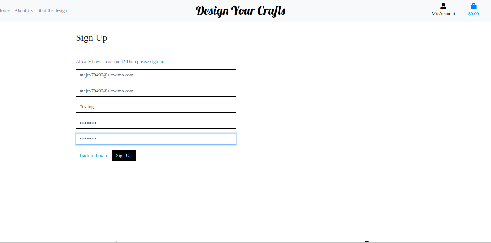 

&nbsp;

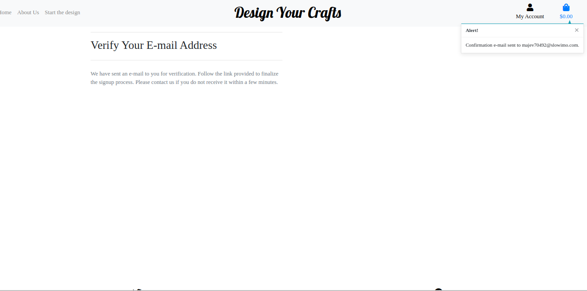 

&nbsp;

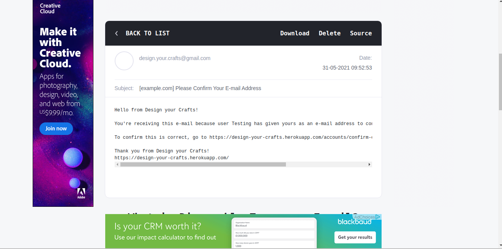 

&nbsp;

**Test:**  Design an item and add it to the bag.  
**Expected Outcome:** The user can design an item and add it to the shopping bag.  
**Passed:** Yes.

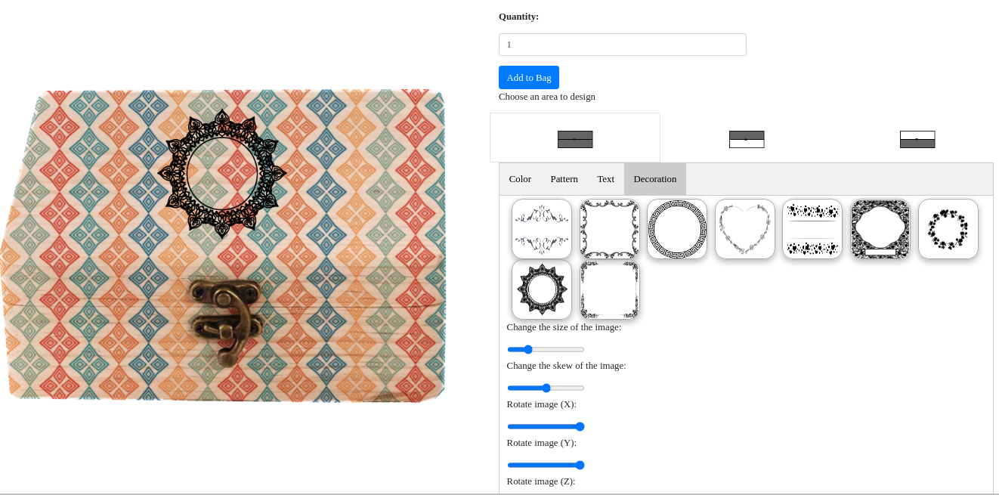 

&nbsp;

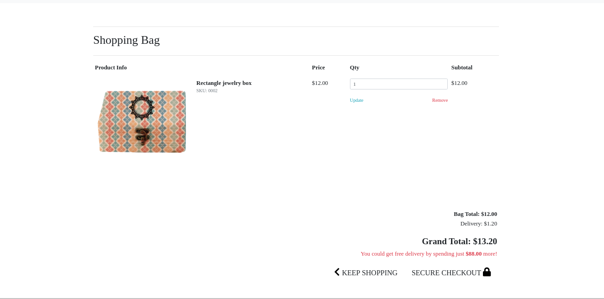 

&nbsp;

**Test:** Checkout successful.  
**Expected Outcome:** After a user buys an item, the summary of the order is displayed.  
**Passed:** Yes 

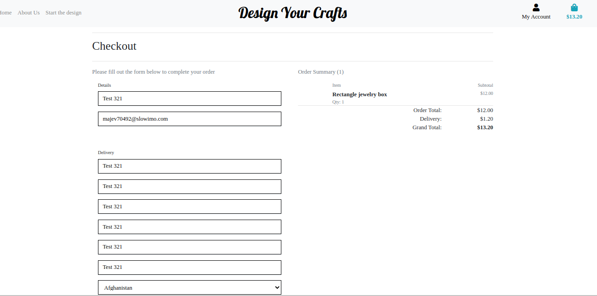 
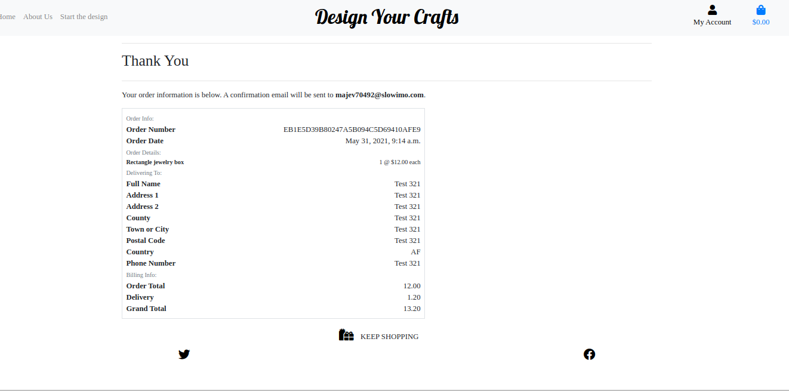 

&nbsp;

**Test:** Profile functionality.  
**Expected Outcome:** The user can see the past orders and designs on their profile.  
**Passed:** Yes  

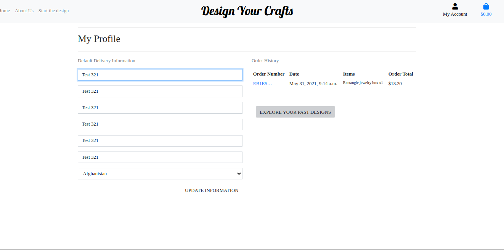 

&nbsp;

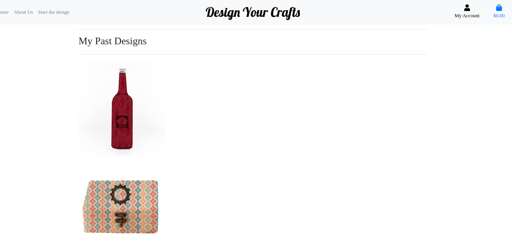 

&nbsp;

**Test:** Sign out.  
**Expected Outcome:**  A session cookie is cleared and no account is logged in.   
**Passed:** Yes 

 

&nbsp;

 

&nbsp;

**Test:** Try to register with an empty email input field.  
**Expected Outcome:** An empty email input field raises an error.  
**Passed:** Yes 

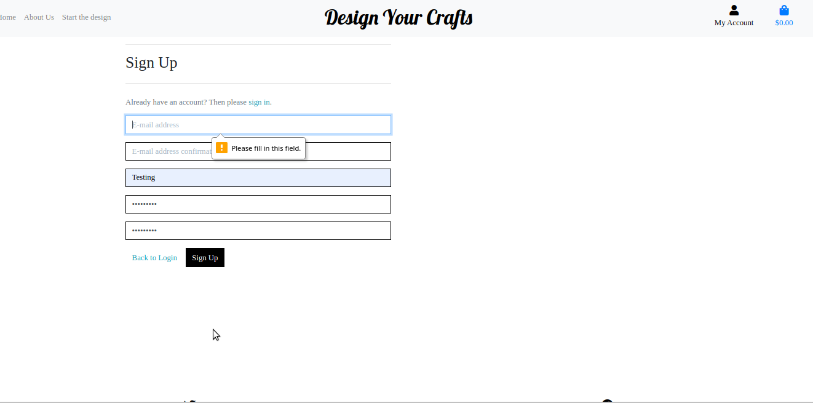 

&nbsp;

**Test:** Try to register with an email that is already registered.   
**Expected Outcome:** Registering with a email that already exists raises an error.  
**Passed:** Yes 

 

&nbsp;

 
 
## Responsiveness test
The website was viewed on a variety of devices such as Desktop, Tablet and Mobile view.

 

&nbsp;

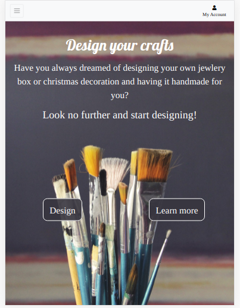 

&nbsp;

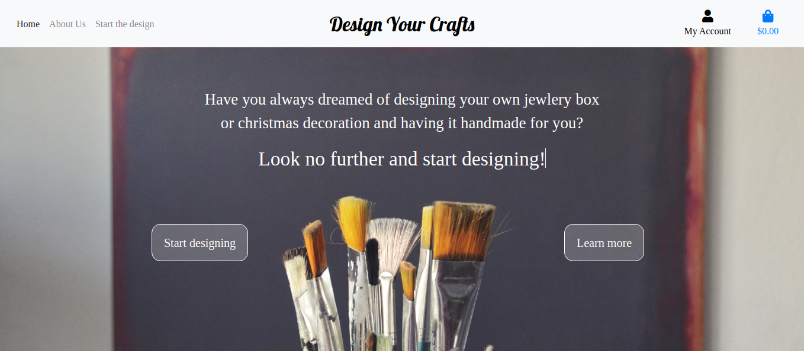 

&nbsp;

## Further testing:
1. A large amount of testing was done to ensure that all pages were linking correctly.
2. Friends and family members were asked to review the site and documentation to point out any bugs and/or user experience issues.

